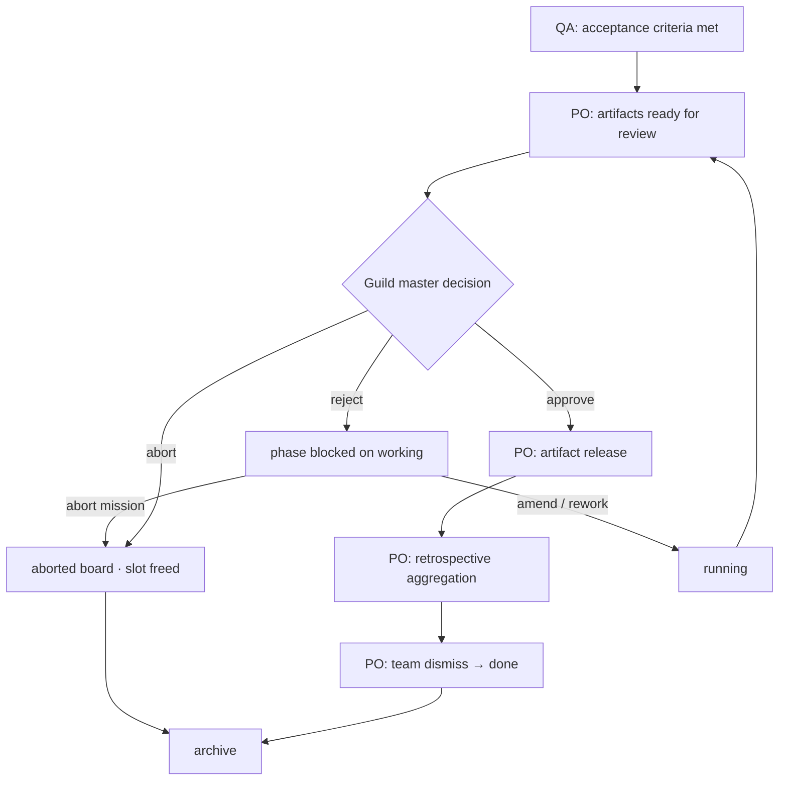

# Guild 0.3.0 — Design specification

Living design for **0.3.0**. Captures alignment between guild master and design review (2026-07-01). When implementation diverges, update this file and `guild-house/specs/product.md` in the same change.

**Source notes:** [workflow-retrospective-idea.md](./workflow-retrospective-idea.md)

---

## 1. Goals

0.3.0 improves **mission close-out**: what happens after the squad believes work is done, before the mission leaves the **working** board and frees an execution slot.

Today (0.2.0):

- PO signals `mission_complete` when QA passes → orchestrator **stops the PO session** and moves **working → done** immediately.
- Artifact handling is ad hoc (e.g. “copy skill to guild-desk”) with no defined plan or phase.
- There is no structured retrospective.
- Guild-master “approval” of deliverables is informal (attach chat); there is no **approve artifacts** API for missions (unlike discovery `POST /discoveries/:id/approve`).
- Orchestrator → live PO notification is **pull-only** (`inbox.md`, restore prompts); a running `--bg` session does not learn about external events.

0.3.0 introduces:

1. **Approve artifacts** — guild-master sign-off on deliverables (separate from discovery approve).
2. **Artifact release** — explicit plan and PO-executed release after approval.
3. **Mission retrospective** — distributed member feedback + PO aggregation.
4. **Extended mission lifecycle** — team stays alive through approval → release → retro → dismiss.
5. **Per-mission-room notification channel** — push orchestrator events into live Claude Code sessions.
6. **Backlog ideas** board column.
7. **Skills bank** and per-agent skill wiring (`wire-skills-from-bank`).

### 1.1 Release strategy — **locked**

- **Product 0.3.0** ships when **all** features above are implemented and reviewed.
- **Implementation** proceeds in [phased dev cycles](./implementation-plan.md) (Phase 0–6) with a **guild-master review gate** after each phase before the next starts.
- API version may bump per phase; product `version.md` → **0.3.0** only at final ship.

---

## 2. Terminology

| Term | Meaning |
|------|---------|
| **Approve artifacts** | Guild master accepts mission deliverables; **not** “approve the mission” or discovery package approve. Preferred wording over “UAT sign-off”. |
| **Discovery approve** | Unchanged: `POST /discoveries/:id/approve` → parking. Different gate, different semantics. |
| **QA pass** | Internal squad gate: acceptance criteria met. PO may signal readiness for guild-master review; does **not** move board or stop session in the new model. |
| **Artifact release** | PO/team executes the plan in `artifact-release.md` after artifacts are approved. |
| **Retrospective** | Files under `retrospective/`; aggregation by PO after release. |
| **Dismiss / mission complete** | Final PO signal; orchestrator stops session and moves **working → done** (frees slot). |
| **Reject artifacts** | Guild master declines deliverables; mission stays on **working** with `phase: blocked` awaiting remediation directive. |
| **Abort mission** | Guild master ends a wrong/meaningless mission early; **working → aborted**; **frees execution slot immediately**; not success. |

---

## 3. Mission lifecycle (target)

### 3.1 Pipeline change

**0.2.0:**

```
… → working → [mission_complete] → done → [archive]
```

**0.3.0 (success path):**

```
… → working
  → [artifacts_ready_for_review]     PO: internal QA done; invite guild master
  → [guild master approves artifacts]
  → [artifact release]               PO executes artifact-release.md
  → [retrospective aggregation]      PO synthesizes reports
  → [team_dismiss / mission_complete]
  → done → [archive]
```

**0.3.0 (abort path):**

```
… → working → [guild master aborts] → aborted → [archive]
```

**Aborted** missions skip the normal approve → release → retro success path. **`aborted` does not count toward `MAX_ACTIVE_MISSIONS`** (slot freed immediately, same as **done**).

Discovery is unchanged: approved packages → parking is already “release” for discovery artifacts.

### 3.2 Phase model (checkpoint) — **locked: explicit close-out phases (A)**

| Phase | Set by | Session / board |
|-------|--------|-----------------|
| `running` / `evaluating` / `paused` | Existing | PO alive; **working** |
| `blocked` | Reject, escalate, awaiting guild master | PO alive; **working** |
| `awaiting_artifact_review` | PO signal `artifacts_ready_for_review` | PO alive; `awaiting_guild_master: true` |
| `artifacts_approved` | `POST /approve-artifacts` or chat tool | PO alive |
| `releasing` | PO signal `artifact_release_complete` sets **next** phase to `retrospective`; enter `releasing` on approve or first release action | PO alive |
| `retrospective` | PO signal `retrospective_complete` → PO may call `mission_complete` | PO alive |
| `done` | PO signal `mission_complete` | Session stopped; **working → done**; frees slot |
| `aborted` | `POST /abort` or chat tool | Session stopped; **working → aborted**; frees slot |

**Phase transitions (success path, signal-driven):**

```
running → awaiting_artifact_review     [artifacts_ready_for_review]
awaiting_artifact_review → artifacts_approved   [approve-artifacts API]
artifacts_approved → releasing         [on approve, or PO starts release]
releasing → retrospective              [artifact_release_complete]
retrospective → done + board move      [mission_complete]
```

**Locked:** Approval does **not** stop session or move board. Only `mission_complete` or `abort` stops session and frees a slot (except **aborted** moves board immediately).

### 3.3 Internal vs external gates



---

## 4. Approve artifacts

### 4.1 What it means

Guild master sign-off that **deliverables are acceptable**, after internal QA. Enables release and retrospective; **not** mission archive (still from **done** board later).

### 4.2 Dual path (mirror discovery)

| Path | Actor | Flow |
|------|-------|------|
| **Chat / attach** | Guild master in PO session | PO signals `artifacts_ready_for_review` → presents → guild master says yes → **PO runs approve tool** (e.g. `tools/approve-artifacts.sh` → `POST /missions/:id/approve-artifacts`) |
| **Web / API** | Guild master from UI | **Approve artifacts** button → orchestrator records approval → notify PO via channel (best-effort) + inbox + checkpoint; PO may need attach if channel does not wake idle session (§5.7) |

Discovery parallel:

- Web: `POST /discoveries/:id/approve`
- Chat: intake lead runs `tools/approve.sh`

Mission parallel:

- Web: `POST /missions/:id/approve-artifacts` *(new)*
- Chat: PO runs `tools/approve-artifacts.sh` when guild master clearly approves in attach/inbox

**Locked:** Lead/PO must not narrate approval before API returns success (same rule as discovery).

### 4.3 Reject artifacts — **locked**

When guild master **rejects** deliverables (not abort):

| Path | Actor | Flow |
|------|-------|------|
| **Web / API** | Guild master | **Reject artifacts** → `POST /missions/:id/reject-artifacts` with reason/notes |
| **Chat** | Guild master in attach | PO runs `tools/reject-artifacts.sh` when guild master clearly rejects |

**Result (both paths):**

- `phase: blocked`, `awaiting_guild_master: true`
- Reason written to `inbox.md` (+ outbox optional)
- Channel push to PO
- **Not** approved — no release until resolved

Mission stays on **working** board (still occupies slot until **done** or **abort**).

### 4.4 After reject — guild master directive — **locked**

While `blocked` after reject, guild master provides how to proceed (attach, inbox, Web/API):

| Directive | PO action |
|-----------|-----------|
| **Amend** specific items | `round_complete` → `running` → fix → `artifacts_ready_for_review` again |
| **Partial rework** | Same; scope narrowed in `memory.md` |
| **Full rework** | Same; broader reset in `memory.md` / squad |
| **Abort mission** | Guild master aborts — see §4.5 (not “proceed to end” with partial ship) |

### 4.5 Abort mission — **locked**

When guild master decides the mission is **wrong, meaningless, or not worth continuing**:

- **Not** “ship anyway” or skip to release with bad artifacts
- **Early terminal close** so the mission does not stuck on **working** stacking slots

| Path | Actor | Flow |
|------|-------|------|
| **Web / API** | Guild master | `POST /missions/:id/abort` (optionally from **blocked** or review) |
| **Chat** | Guild master | PO runs `tools/abort.sh` when guild master clearly aborts |

**Result:**

- Stop PO session
- Move **working/{id}** → **aborted/{id}**
- `phase: aborted` on checkpoint
- **`MAX_ACTIVE_MISSIONS` slot freed immediately** (same rule as **done**)
- **Skip artifact release**
- **Minimal close-out note** — PO writes short `retrospective/abort-note.md` before abort completes (why aborted, lessons learned). Guild master may or may not supply a reason; PO records what is known.
- Guild master **archive** from **aborted** when ready (`POST /missions/:id/archive` — extend gate from done-only)

---

## 5. Orchestrator → live session notification

### 5.1 Problem

Checkpoint + `inbox.md` (option C) are correct **persistence**, but a running `--bg` Claude Code session does not poll them. Options A or B alone share the same gap: **no push**.

Guild today is pull-based for guild-master → team:

- `inbox.md` — manual or future API write; PO reads on restore/attach
- `checkpoint` — Web UI visibility only
- `blocked` + outbox — works because PO called escalate and is idle
- Attach — interactive, not orchestrator-driven

Web/API **approve artifacts** requires **push** into the live PO session.

### 5.2 Solution: per-mission-room Claude Code channel

Use [Claude Code Channels](https://code.claude.com/docs/en/channels-reference) (research preview, v2.1.80+):

- MCP server declares `capabilities.experimental['claude/channel']`
- Claude Code spawns channel MCP as subprocess in the **mission room** session (stdio)
- Channel HTTP listener receives POST from orchestrator → `notifications/claude/channel`
- Event appears as `<channel source="guild-house" event="…">` on PO’s next turn (**queued if Claude is busy processing**; see §5.7 for idle-session limits)

**Locked: per-mission-room** (not a single guild-house sidecar). Matches CC’s session-scoped MCP model and `MAX_ACTIVE_MISSIONS` routing.

Discovery rooms **out of scope** for channels: Web approve closes discovery; intake lead does not need wake-up for post-approve work.

### 5.3 Room layout

```
mission-rooms/{id}/
  .mcp.json                          # spawns guild-channel when PO session starts
  .guild/
    channel-endpoint.json            # { "port": N } written by channel on startup
  inbox.md                           # orchestrator writes on every guild-master action
  checkpoint.yaml                    # orchestrator-only; phase source of truth for UI
  artifact-release.md
  retrospective/
  artifacts/
  …
```

### 5.4 Push + fallback

On orchestrator events (e.g. `approve-artifacts`, future inbox API):

1. Update `checkpoint.yaml` (phase, flags)
2. Append/write `inbox.md` with directive text
3. If `channel-endpoint.json` exists and port is live → POST to localhost with auth (`GUILD_API_KEY` header or shared secret); **sender gating** required (ungated HTTP = prompt injection per CC docs). API `notify.channel.delivered: true` means **HTTP/MCP transport accepted the POST**, not that the PO executed the playbook.
4. If session down, stale endpoint, or no port → **degraded mode**; PO picks up on restore/attach (or guild-master chat in attach) via `inbox.md` + checkpoint — see §5.7

Channel `instructions` must tell Claude: events from `source="guild-house"` are orchestrator directives; read `inbox.md` and checkpoint; follow playbook; not user chat.

### 5.5 Research preview constraints

- Custom channels need `--dangerously-load-development-channels` until allowlisted or org policy enables them
- Phase 0 PoC proved: `--bg` PO loads channel MCP; orchestrator POST returns `ok`; optional log poll may show `<channel>` tags. **Did not prove** idle PO auto-executes close-out after approve (§5.7).
- One-way channel sufficient for approve/inbox **when CC wake works**; two-way / permission relay is future

### 5.7 Known limitation — idle `--bg` PO may not wake on channel (as-built 2026-07)

**Status:** Accepted for 0.3.0. Channel push remains implemented; **do not rely on it alone** for Web approve → release.

Manual validation (channel approve E2E, 2026-07-03) and upstream reports match: orchestrator can succeed end-to-end at the **transport** layer while the PO never starts a new agent turn.

| Layer | What happens | Reliable? |
|-------|----------------|-----------|
| **Ledger** | `checkpoint.yaml` + `inbox.md` updated on approve/reject/abort | Yes |
| **Transport** | POST to `channel-endpoint.json` → `mcp.notification(notifications/claude/channel)` → HTTP `ok` | Usually, when MCP HTTP is live |
| **PO wake / act** | Idle `--bg` PO at prompt processes channel and runs release playbook | **No** — not dependable today |

**Symptoms observed:**

- Web **Approve artifacts** updates phase to `releasing` and inbox; UI looks “stuck” until PO moves.
- API logs `notify.channel.delivered: true` but PO attach chat still says “waiting for guild master approval.”
- PO may report it never saw `<channel source="guild-house" …>` in the conversation; learning approval only after **explicit attach chat** and `Read inbox.md` (non-deterministic).
- PoC log grep for `<channel` can false-positive on spawn prompts that mention channel tags in prose.

**Upstream:** Claude Code [issue #44380](https://github.com/anthropics/claude-code/issues/44380) — idle sessions receive channel notifications at the harness/transport level but the REPL does not interrupt to process them; stdin takes priority. Related: [#37139](https://github.com/anthropics/claude-code/issues/37139) (silent drop when idle). Guild `guild-channel` uses the same `notifications/claude/channel` path as official channel plugins.

**Secondary edge case:** `channel-endpoint.json` can outlive the MCP HTTP listener after PO stop/resume (stale port). Orchestrator probes port liveness but does not bind endpoint to current session id — can yield `delivered: false` or POST to a dead/orphan listener. Distinct from idle-wake failure.

**Operational workaround (0.3.0):** Guild master **attach** to mission room and approve in chat (PO runs `tools/approve-artifacts.sh` or reads `inbox.md` after guild-master message). Web approve still writes ledger correctly; attach is the reliable wake path until CC or Guild ships a stronger nudge.

**Deferred product fixes (backlog):**

- Approve后 **force respawn** with `resumeSpawnPrompt` embedding inbox directive (orchestrator-owned turn).
- UI copy: `delivered` → “channel POST ok” + hint if `artifact-release.md` stays non-`released`.
- PoC: add **idle wake** scenario (spawn → wait for idle → POST → assert filesystem close-out progress).
- Tighter endpoint health (session id in endpoint file; clear on restore).

**Locked semantics unchanged:** filesystem + checkpoint remain source of truth; channel is **best-effort wake-up bus**, not a guarantee. PO must not edit `checkpoint.yaml` (orchestrator-only); corrupted checkpoint YAML breaks API reads.

### 5.6 Future reuse

Same channel can carry:

- `artifacts_approved`
- `inbox_directive` (guild master message via API)
- `outbox_reply` (guild master answered escalation)
- Other orchestrator → PO nudges

Filesystem + checkpoint remain the **ledger**; channel is the **best-effort wake-up bus** for live sessions (§5.7).

---

## 6. Artifact release

### 6.1 Problem

Outputs land in `artifacts/` with no defined post-mission handling. Occasional “deploy skill to guild-desk” is implicit, not auditable.

### 6.2 Plan file — **locked: `artifact-release.md`** at mission room root

Not `memory.md` (rolling team truth) or frozen brief. Dedicated file for release intent and status.

Suggested sections:

| Section | Purpose |
|---------|---------|
| **Mode** | `stay` \| `deploy` \| `custom` |
| **Target** | e.g. `guild-desk/.claude/skills/guild-master/` when deploy |
| **Source paths** | Which artifact subtrees to release |
| **Notes** | Custom steps; guild-master decisions from chat |
| **Status** | `draft` → `confirmed` → `released` |

### 6.3 When the plan is decided — **locked: C with Web/API escape hatch**

| When | What |
|------|------|
| **Scope eval (Round 1–2)** | PO drafts rough plan in `artifact-release.md` |
| **Artifacts ready (chat path)** | Guild master can confirm or refine → PO sets `confirmed` |
| **Artifacts ready (Web/API path)** | No Q&A at approve time → **PO decides and executes** per plan |

**PO-alone default hierarchy:**

1. Explicit plan in `artifact-release.md` / scope eval
2. Mission brief already states deploy target (e.g. “update guild-master skill”)
3. Otherwise → **stay in `artifacts/`** (default)

Web/API approve means “yes, ship it” — not “negotiate release in the UI.”

### 6.4 Execution — **locked: PO / team manual (A)**

Orchestrator does **not** run deploy recipes in 0.3.0. PO copies, installs, runs scripts per plan — leverage LLM judgment for flexibility.

**Future:** optional `POST /missions/:id/release-artifacts` for mature, well-known targets (guild-desk skills, etc.) when patterns stabilize.

Discovery: no artifact-release phase (missions in parking are the release).

---

## 7. Mission retrospective

### 7.1 Problem

No structured feedback after missions; skills/workflow improvements are lost.

### 7.2 Output layout (from brainstorm; **locked** structure)

```
mission-rooms/{id}/retrospective/
  members/
    project-owner/feedback.md
    evaluator/feedback.md
    developer/feedback.md
    …
  workflow-report.md          # PO combined report (success path)
  abort-note.md               # Short close-out when mission aborted (§4.5)
  skills-reports/
    {short-name}.md
```

**`workflow-report.md`:** Self-contained — brief mission background + synthesized feedback; brief pointer to `skills-reports/` without duplicating skill detail.

**`skills-reports/`:** (1) feedback on existing agent skills; (2) proposals for new reusable skills.

### 7.3 Two-phase model — **locked**

| Phase | When | Who | Mechanism |
|-------|------|-----|-----------|
| **Collection** | Anytime; **required before member leaves** | Each squad member | Write `retrospective/members/{role}/feedback.md` |
| **Aggregation** | After artifact release | PO | Read all feedback; ping survivors; write `workflow-report.md` + `skills-reports/` |

**Not** a live agent-team retro meeting. Most members are gone by formal retro time (evaluator leaves Round 1).

### 7.4 Member exit contract — **locked**

Each member `agent.md` + spawn prompt:

1. **Ongoing:** may append to `retrospective/members/{role}/feedback.md` anytime (including mid-mission).
2. **Before leave:** must write or update feedback for their involvement.
3. **Safety check:** do not dismiss self until file exists and is current — even if PO forgets to ask.

PO reminds on dismiss; member owns the guarantee.

**Evaluator:** writes at end of Round 1 (scope/charter experience only — short). Do not respawn for retro.

**Implementers:** write at exit; may have left long before release.

### 7.5 Formal retro phase (aggregation) — **locked**

No live squad meeting. PO:

1. Reads all `retrospective/members/*/feedback.md`
2. **Pings still-living members** (usually PO; maybe dev/qa) for optional **`## Final pass`** section — only if post-release / approval notes exist
3. Writes `workflow-report.md` and distills `skills-reports/`
4. Signals team dismiss / `mission_complete`

Optional bounded **Task** for survivors: “Finalize feedback.md; add `## Final pass` if needed.”

### 7.6 `## Final pass` convention — **locked**

- **Survivors only** (members still alive after release — typically PO)
- **Optional** — add section only if something new since others left (release, Web approve, channel behavior)
- Gone members’ files are complete from exit write; no empty `## Final pass` required

Example member file:

```markdown
# Developer feedback

## During mission
- …

## At exit
- …

## Final pass
- Release copy to guild-desk went smoothly; …
```

### 7.7 Feedback prompts (content guidance)

Cover where applicable:

- General mission journey
- What went well / badly
- Workflow gaps or useless steps
- Mission workflow improvements
- Skills wired on agents (when skills bank exists)
- Ideas worth distilling into new skills

---

## 8. Signals and API — **locked names**

### 8.1 PO signals

| Signal | Phase after signal |
|--------|-------------------|
| `artifacts_ready_for_review` | `awaiting_artifact_review`; `awaiting_guild_master: true` |
| `artifact_release_complete` | `retrospective` |
| `retrospective_complete` | `retrospective` (unchanged); playbook: then `mission_complete` |
| `mission_complete` | `done`; stop session; **working → done** |
| `round_complete` / `blocked` / `request_session_restart` | *(existing)* |

**On approve-artifacts API (not a PO signal):** `artifacts_approved` → then PO enters `releasing` when starting release work (or immediately on approve — implementation may set `releasing` in same API handler).

### 8.2 Guild-master API

| Endpoint | Purpose |
|----------|---------|
| `POST /missions/:id/approve-artifacts` | Web/UI approve; updates checkpoint, inbox, channel push |
| `POST /missions/:id/reject-artifacts` | Web/UI reject; `phase: blocked`, inbox, channel push |
| `POST /missions/:id/abort` | Early terminate; **working → aborted**; stop session; free slot |
| `POST /missions/:id/archive` | Extend: from **done** or **aborted** board |

### 8.3 Mission room tools (candidates)

| Tool | Purpose |
|------|---------|
| `tools/approve-artifacts.sh` / `.cmd` | Chat-path approve → same endpoint as Web |
| `tools/reject-artifacts.sh` / `.cmd` | Chat-path reject |
| `tools/abort.sh` / `.cmd` | Chat-path abort |

### 8.4 Slot semantics

**Locked intent:**

- Mission on **working** counts toward `MAX_ACTIVE_MISSIONS` through full close-out (approve → release → retro) until **done** or **abort**.
- **`done`** and **`aborted`** free the execution slot immediately.
- **`aborted`** is a separate board column from **done** (not a success).

---

## 9. Feature 3 — Backlog ideas column

**Intent:** Ideas that should park and incubate without entering discovery on bell.

```
backlog-ideas → [promote] → ideas → [tick] → discovering → …
```

### 9.1 Submit destination — **locked: C (chooser)**

Guild master picks at submit time:

| Surface | Control |
|---------|---------|
| **Web UI** | Submit modal: “Add to backlog” vs “Add to ideas” |
| **API** | `POST /ideas` body field `board: "backlog" \| "ideas"` |

**API default when `board` omitted — locked: `backlog`** (new ideas incubate first unless explicitly sent to **ideas**).

### 9.2 Board folder — **locked: `ideas-backlog/`**

Filesystem path under idea board (exact stage name TBD in `paths.ts`; display label “Backlog” or “Ideas backlog” in UI). Not `backlog-ideas/` or bare `backlog/`.

Pipeline:

```
ideas-backlog/ → [promote] → ideas/ → [tick] → discovering/ → …
```

### 9.3 Tick / bell — **locked**

`orchestratorTick()` / `POST /bell` only moves entries from **ideas/** → discovering. **ideas-backlog/** never auto-ticks.

### 9.4 Promote — **locked**

Web UI + API: promote **ideas-backlog** → **ideas** (e.g. `POST /board/ideas-backlog/:id/promote`).

**No demote (0.3.0):** ideas → ideas-backlog is **out of scope**. Race with periodic tick makes safe demote non-trivial on filesystem-first storage.

*Future (deferred):* safe concurrent board ops — see §11.

### 9.5 Backlog entry on disk — **locked: B (full idea entry)**

Same shape as **ideas/** today — not a bare stub, not lazy-empty:

```
mission-board/ideas-backlog/{ideaId}/
  scratch.md          # submitted text (same as POST /ideas today)
```

No **discovery-rooms/** scaffold until promote → **ideas/** → tick. Promote is a board-folder rename (or equivalent); discovery pickup unchanged.

### 9.6 Open questions

- Board UI: eighth column layout

---

## 10. Feature 4 — Skills bank

**Intent:** Central catalog of Claude-style skills; **deterministically** copied into mission/discovery `.claude/skills/` at team formation.

### 10.1 Skills bank layout — **leaning flat**

```
guild-house/data/skills-bank/
  catalog.md
  {skill-name}/
    SKILL.md
    …
```

### 10.2 Room layout (target)

```
mission-rooms/{id}/          # discovery-rooms/{id}/ parity
  .claude/skills/
    wire-skills-from-bank/   # bundled meta-skill (see §10.3) — always present
    {other-skills}/          # copied from bank at charter time
  members/{role}/
    agent.md
    skills.md                # which skills this agent should use
```

### 10.3 Deterministic copy — **locked**

Copy must **not** be ad-hoc LLM `cp`. Use a **bundled meta-skill** shipped in every mission/discovery room template:

| Item | Choice |
|------|--------|
| **Skill name** | **`wire-skills-from-bank`** (recommended; see naming note below) |
| **Location** | Pre-exists in template `.claude/skills/wire-skills-from-bank/` at scaffold — not copied from bank (bootstrap skill) |
| **Behavior** | SKILL.md + bash script: given skill names, copy `skills-bank/{name}/` → room `.claude/skills/{name}/` |
| **Caller** | PO (or intake lead for discovery) invokes this skill during charter / team formation workflow |

**Naming:** `equip-skills-to-project` is clear but long. Prefer **`wire-skills-from-bank`** — matches “wired on agents” language in brainstorm; states source and action. Shorter alias in docs: “wire skill”.

PO workflow:

1. Read `skills-bank/catalog.md` (+ mission brief / evaluator input).
2. Decide which bank skills the squad needs.
3. **Run `wire-skills-from-bank`** via CLI args — e.g. `wire.sh skill-a skill-b` (deterministic copy).
4. Write `members/{role}/skills.md` per agent.

**Wire interface — locked: A (CLI args).** No manifest file required in 0.3.0. PO (or skill script) passes explicit skill names on the command line.

**Skills bank path — locked: B (fixed relative).** From mission/discovery room cwd (`data/mission-rooms/{id}/` or `data/discovery-rooms/{id}/`), wire script resolves bank as:

```
../skills-bank/{skill-name}/
```

(both room types are siblings under `data/`). Copies to `.claude/skills/{skill-name}/`. No env var in 0.3.0.

### 10.4 When to wire — **locked**

| Room | When | Who |
|------|------|-----|
| **Mission** | **Round 0 intake** — before evaluator | PO wires skills so evaluator and downstream roles can use them |
| **Discovery** | **Round 0 intake** — before explore/draft | Intake lead wires skills for discovery work |

Order in handoff: read brief/scratch → **wire skills from bank** → spawn evaluator (mission) or begin explore (discovery) → write `members/{role}/skills.md` assignments as squad/forms.

### 10.5 Skills-reports → bank — **locked: A (guild master manual)**

Retrospective `skills-reports/*.md` are **proposals only**. Guild master reads them and manually creates/updates entries in `data/skills-bank/` + `catalog.md`. No `POST /skills-bank` in 0.3.0.

---

## 11. Future — orchestrator-mediated state (deferred)

Guild today is **filesystem-first**: board folders are source of truth; API scans and renames. Concurrent operations (auto-tick, promote, demote, abort) can race on the same entry.

A future “safe ops” layer would likely:

- Store mission/idea **state in DB or artifact store** (context blobs — not mission `artifacts/` deliverables)
- Keep **room folders as workspaces** for Claude spawn cwd only
- Route all board transitions through backend with **locking / versioning / fork-per-operation**
- Tick and guild-master actions become atomic transactions against state, not best-effort renames

Large refactor — not prerequisite for 0.3.0. Until then: **promote-only** for backlog, atomic renames where possible, clear 409s on conflict.

---

## 12. Future — Team formation committee

*Explicitly deferred.*

Separate short-lived team to decide squad composition + skill wiring + copy skills to `.claude/skills/`, then dismiss before main discovery/mission work. Depends on Feature 4.

---

## 13. Web UI — **aligned (2026-07-03)**

### 13.1 Close-out (Phase 4 — shipped)

- **Approve artifacts** on mission room when `phase === awaiting_artifact_review`
- Phase pills for close-out phases (board, hall, mission room)
- **Close-out** tab: read-only `artifact-release.md`, `retrospective/**` tree
- Reject / abort actions on working mission room
- Board slot meter still counts mission until `done`

### 13.2 Parking & queued intake detail (Phase 4.5 — **locked**)

**Problem (manual test 2026-07-03):** After discovery **Approve**, mission packages land on **Parking**. The board card is not clickable; the only action is a small **Promote → queued** button on the card. Guild masters cannot read `mission.md` before promoting, and promote is easy to click by accident — skipping the intentional parking review step.

**Design principle:** Mirror discovery intake UX — **idea room** has **Approve** in the detail view, not as a tiny board-card action alone.

| Stage | Board card | Detail view (`/missions/:id`) |
|-------|------------|-------------------------------|
| **Parking** | Clickable link only (no promote on card) | Read **Brief** (`mission-board/parking/{id}/mission.md` via existing API fallback); primary **Promote to queued** with confirm dialog |
| **Queued** | Clickable link only | Read **Brief**; status “Awaiting bell”; link/hint to board **Ring bell** — no promote |
| **Working+** | Unchanged | Full mission room (terminal, close-out, etc.) |

**Route:** Reuse **`/missions/:id`** (`MissionPage`) — no new route. `GET /missions/:id/summary` and `/brief` already resolve parking and queued board entries (`getMission` in orchestrator).

**Tabs by board stage:**

| Board | Tabs shown |
|-------|------------|
| `parking`, `queued` | **Brief** only (default tab) |
| `working` | Brief, checkpoint, close-out, events, outbox, terminal |
| `done`, `aborted` | Brief + archive-oriented subset (no terminal) |

**Actions by board stage:**

| Board | Header actions |
|-------|----------------|
| `parking` | **Promote to queued** (guild master; `POST /board/parking/:folder/promote`) + confirm |
| `queued` | None (or passive “Ring bell on board to start”) |
| `working` | Existing MissionActions + approve artifacts when applicable |

**Out of scope (4.5):** New API endpoints; editing `mission.md` from Web UI; mission room files before bell (no room until pickup).

**Exit criteria:** Guild master can open parking package from board, read brief, deliberately promote from detail view; queued package is readable before bell.

---

## 14. Template & playbook changes (summary)

| Area | Change |
|------|--------|
| `handoff-prompt.md` | Round 4 split: QA ready → review → release → retro → complete |
| `project-owner/agent.md` | Approve-artifacts chat path; release; retro aggregation |
| `members/*/agent.md` | Exit retro contract; optional mid-mission notes |
| `mission-room/.mcp.json` | guild-channel server |
| `mission-room` scaffold | `artifact-release.md`, `retrospective/` tree |
| `guild-house` orchestrator | New phases, signals, approve endpoint, channel notify helper |
| Spawn / resume prompts | Channel + close-out phase awareness |

---

## 15. Locked decisions checklist

- [x] “Approve” means **approve artifacts** (guild-master deliverable sign-off after QA)
- [x] Dual path: chat + Web/API (like discovery)
- [x] Approval does **not** dismiss team or move to done
- [x] Persistence: checkpoint + `inbox.md` + **per-mission channel push** (channel = best-effort; §5.7)
- [x] Channel: **per-mission-room**, one-way, orchestrator → PO
- [x] Release plan: **`artifact-release.md`**
- [x] Plan timing: scope eval + chat refine; Web/API → PO decides
- [x] Release execution: **PO manual**; no orchestrator deploy runner in 0.3.0
- [x] Retro: **distributed collection** at member exit + **PO aggregation**; no live meeting
- [x] Optional **`## Final pass`** for survivors only
- [x] Reject artifacts → `phase: blocked` on **working**; dual path Web + chat
- [x] After reject: guild master directive (amend / rework / abort)
- [x] **Abort** naming; **`aborted/`** board column; frees slot immediately
- [x] **Abort** close-out: skip release; PO writes `retrospective/abort-note.md` (reason optional from guild master)
- [x] Explicit checkpoint phases: `awaiting_artifact_review` → `artifacts_approved` → `releasing` → `retrospective` → `done`
- [x] Signals: `artifacts_ready_for_review`, `artifact_release_complete`, `retrospective_complete`, `mission_complete`
- [x] Feature 3 backlog ideas — `ideas-backlog/`, default `backlog`, promote only, full entry = `scratch.md`
- [x] Feature 4 skills bank — wire Round 0, CLI args, `../skills-bank/`, manual bank updates from retro
- [x] **Parking / queued detail UI** — clickable board cards; promote only in mission detail view (§13.2)
- [x] Channel PoC validated transport on WSL with `--bg` PO; **idle wake not validated** (§5.7)

---

## 16. Remaining alignment topics

**Alignment complete for 0.3.0 design** (2026-07-01). Open items are **implementation / Phase 0 review** only:

- Channel **idle wake** — upstream CC limitation; Guild workaround = attach approve path until respawn-nudge ships (§5.7)
- Board UI eighth column layout (implementation detail)

Proceed: [implementation-plan.md](./implementation-plan.md) Phase 0 → review gate → Phase 1 …

---

## 17. References

- [guild-house/specs/product.md](../../guild-house/specs/product.md) — 0.2.0 as-built
- [guild-house/docs/api.md](../../guild-house/docs/api.md) — REST reference
- [Claude Code Channels](https://code.claude.com/docs/en/channels-reference)
- [workflow-retrospective-idea.md](./workflow-retrospective-idea.md) — raw brainstorm
