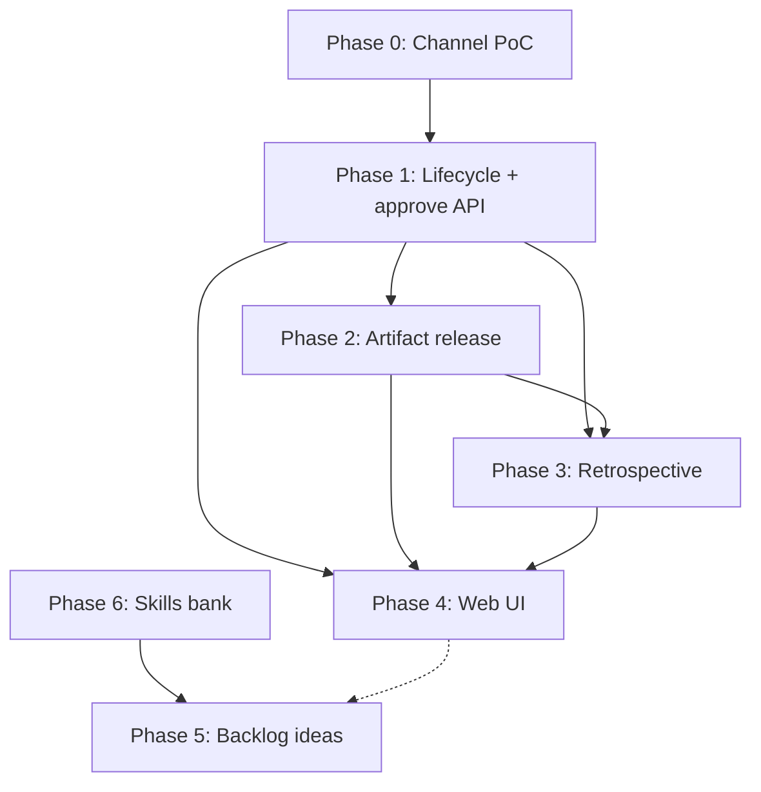

# Guild 0.3.0 — Implementation plan

Phased task list for [design.md](./design.md). Order respects dependencies: **channel PoC → lifecycle/API → templates/playbooks → Web UI → backlog/skills**.

**Convention:** `[ ]` not started · `[~]` in progress · `[x]` done (update as work lands)

---

## Dependency overview



**Suggested 0.3.0 MVP slice:** Phases 0–4 (close-out + notification). Phases 5–6 may ship as 0.3.x or 0.4.0 after alignment.

---

## Product 0.3.0 scope vs implementation phasing — **locked**

| Layer | Scope |
|-------|--------|
| **Product release 0.3.0** | **Everything** in [design.md](./design.md) — Phases 0–6 (close-out, channel, backlog ideas, skills bank) |
| **Implementation** | **Multiple dev phases** (0 → 6 below); **review gate after each phase** before starting the next |

Workflow:

```
Phase N implement → guild master review → approve → Phase N+1
…
All phases complete → ship product 0.3.0 (version.md, specs, changelog)
```

Do not bump product to **0.3.0** until all planned phases are done and reviewed. Intermediate API bumps (`GET /health`) per phase are fine.

**Phase order:** 0 → 1 → 2 → 3 → 4 → 5 → 6 (see dependency diagram below). Phase 5 and 6 can overlap with 4 only after 4 review if desired — default is sequential.

---

## Review gates (per phase)

After each phase, guild master reviews before the next phase starts:

| After phase | Review focus |
|-------------|----------------|
| **0** | Channel PoC — event reaches live `--bg` PO |
| **1** | Approve / reject / abort lifecycle; slot rules |
| **2** | `artifact-release.md` + PO playbook |
| **3** | Retrospective files + exit contract |
| **4** | Web UI close-out actions |
| **5** | Backlog column + submit chooser + promote |
| **6** | Skills bank + `wire-skills-from-bank` in templates |

---

## Phase 0 — Guild channel PoC

Prove orchestrator can push events into a live `--bg` PO session in a mission room.

| ID | Task | Notes |
|----|------|-------|
| 0.1 | [x] Spike: confirm CC v2.1.80+ and `--dangerously-load-development-channels` on WSL dev setup | Document in `guild-house/docs/` |
| 0.2 | [x] Implement minimal `guild-channel` MCP server (Bun + `@modelcontextprotocol/sdk`) | One-way; localhost HTTP; `claude/channel` capability |
| 0.3 | [x] On startup write `.guild/channel-endpoint.json` with bound port | Orchestrator will read this |
| 0.4 | [x] Sender gate: require `Authorization: Bearer $GUILD_API_KEY` (or dedicated secret) on POST | No ungated injection |
| 0.5 | [x] Add `templates/mission-room/.mcp.json` entry for guild-channel | Relative path from room cwd |
| 0.6 | [x] Channel `instructions`: guild-house events are directives; read inbox + checkpoint | Event attr `event="…"` |
| 0.7 | [x] PoC script: spawn test mission PO → POST test event → verify `<channel>` in session | e.g. `scripts/poc-guild-channel.ts` |
| 0.8 | [x] Document degraded mode when endpoint missing / session stopped | inbox + restore prompt only |

**Exit criteria:** Orchestrator (or curl) POST → PO session receives channel event and playbook says to read `inbox.md`.

---

## Phase 1 — Mission lifecycle & approve artifacts

Refactor close-out so `mission_complete` is final dismiss only; add approve-artifacts path.

| ID | Task | Notes |
|----|------|-------|
| 1.1 | [x] Extend mission checkpoint schema: new phases + signals | `specs/` + `types/mission.ts` |
| 1.2 | [x] Add signal `artifacts_ready_for_review` | Sets `awaiting_artifact_review`, `awaiting_guild_master: true`, outbox optional |
| 1.3 | [x] Add `POST /missions/:id/approve-artifacts` | Guild master only; does **not** stop session or move board |
| 1.4 | [x] Add `tools/approve-artifacts.sh` / `.cmd` | Same endpoint as Web |
| 1.5 | [x] On approve: update checkpoint, write `inbox.md`, POST channel notify | Use Phase 0 helper |
| 1.6 | [x] Split `mission_complete`: only on final dismiss → stop session, working → done | **Breaking** vs 0.2.0 |
| 1.7 | [x] Add optional signals `artifact_release_complete`, `retrospective_complete` | Or fold into phase transitions only |
| 1.8 | [x] Update `lifecycle.ts` / `handleSignal` for new state machine | No auto-stop on approve |
| 1.9 | [x] Boot migration / reconcile for in-flight missions on upgrade | Document manual steps if any |
| 1.10 | [x] Bump `GET /health` version; update `docs/api.md` | API semver bump |
| 1.11 | [x] Update `specs/product.md` locked semantics for 0.3.0 pipeline | Board pipeline diagram |
| 1.12 | [x] **Align:** revision / reject flow when guild master wants changes | Design §4.3–4.4 |
| 1.13 | [x] Add `POST /missions/:id/reject-artifacts` + `tools/reject-artifacts.*` | → blocked on working |
| 1.14 | [x] Add `POST /missions/:id/abort` + `tools/abort.*` | working → aborted; stop session; free slot |
| 1.15 | [x] Add `aborted/` board folder + `listBoard` / slot counting | aborted excluded like done |
| 1.16 | [x] Extend `POST /missions/:id/archive` for **aborted** board | |
| 1.17 | [x] On abort: PO writes `retrospective/abort-note.md` before API completes or as abort playbook step | Skip release; reason optional |

**Exit criteria:** E2E path: QA ready signal → Web approve → channel/inbox → PO still on working board → final complete moves to done.

---

## Phase 2 — Artifact release

| ID | Task | Notes |
|----|------|-------|
| 2.1 | [ ] Scaffold `artifact-release.md` template in mission-room | Mode, target, sources, notes, status |
| 2.2 | [ ] Update handoff Round 1–2: PO drafts release plan at scope eval | design §6.3 |
| 2.3 | [ ] Update PO playbook: chat refine at review; Web approve → PO executes | Default hierarchy stay/deploy |
| 2.4 | [ ] PO playbook: release phase after `artifacts_approved` | Manual execution only |
| 2.5 | [ ] Extend `room-read.ts` allowlist for `artifact-release.md` | Web UI Files tab later |
| 2.6 | [ ] Log milestone on release complete | events.jsonl |
| 2.7 | [ ] **Defer:** `POST /release-artifacts` orchestrator recipes | Future mature targets |

**Exit criteria:** Mission room contains completed `artifact-release.md` with `status: released` before retro.

---

## Phase 3 — Mission retrospective

| ID | Task | Notes |
|----|------|-------|
| 3.1 | [ ] Scaffold `retrospective/` tree in mission-room template | `members/`, `skills-reports/` |
| 3.2 | [ ] Add feedback template or section headings in member playbooks | During mission, at exit, optional Final pass |
| 3.3 | [ ] Evaluator playbook: write `retrospective/members/evaluator/feedback.md` before Task return | Scope-phase retro |
| 3.4 | [ ] Developer / QA / senior-dev playbooks: exit contract + safety check | design §7.4 |
| 3.5 | [ ] PO playbook: aggregation phase — read feedback, ping survivors, `workflow-report.md` | No live meeting |
| 3.6 | [ ] PO playbook: distill `skills-reports/*.md` from skill-related notes | Two kinds per brainstorm |
| 3.7 | [ ] Extend `room-read.ts` allowlist for `retrospective/**` | |
| 3.8 | [ ] Signal/gate: retro complete before final `mission_complete` | Playbook + optional signal |

**Exit criteria:** Done mission has per-member feedback files + `workflow-report.md` on disk.

---

## Phase 4 — Web UI

| ID | Task | Notes |
|----|------|-------|
| 4.1 | [ ] Phase pills / badges for close-out phases | Board, hall, mission room |
| 4.2 | [ ] **Approve artifacts** button on mission room | When `awaiting_artifact_review` |
| 4.3 | [ ] Wire `approveArtifacts` in `lib/api/missions.ts` | |
| 4.4 | [ ] Mission room: view `artifact-release.md` | Files tab or dedicated section |
| 4.5 | [ ] Mission room: view `retrospective/workflow-report.md` (+ tree) | Read-only |
| 4.6 | [ ] Invalidate queries on approve + phase change | board, hall, summary |
| 4.7 | [ ] Update execution E2E doc for new close-out path | `docs/tests/execution-e2e.md` |
| 4.8 | [ ] Update discovery-path doc if cross-links needed | Minor |

**Exit criteria:** Guild master can approve artifacts from browser and see phase progression without attach.

---

## Phase 5 — Backlog ideas column

*Blocked on design alignment §9.* → largely aligned; implement in Phase 5.

| ID | Task | Notes |
|----|------|-------|
| 5.1 | [x] Backlog entry = `ideas-backlog/{id}/scratch.md` (same as ideas) | Design §9.5 |
| 5.2 | [ ] Add `ideas-backlog/` board stage + `listBoard` support | `paths.ts`, orchestrator |
| 5.3 | [ ] `POST /ideas` — `board: "backlog" \| "ideas"`; default **backlog** | Design §9.1 |
| 5.4 | [ ] `POST /board/ideas-backlog/:id/promote` → ideas | Mirror parking promote |
| 5.5 | [ ] Tick: only consume **ideas** column, not backlog | `orchestratorTick` |
| 5.6 | [ ] Submit idea modal: backlog vs ideas chooser | `SubmitIdeaModal` |
| 5.7 | [ ] Web UI: eighth column + promote action on backlog cards | `BoardPage.tsx` |
| 5.8 | [ ] Update `specs/product.md` pipeline diagram | |

---

## Phase 6 — Skills bank

*Blocked on design alignment §10.* → largely aligned; implement in Phase 6.

| ID | Task | Notes |
|----|------|-------|
| 6.1 | [x] skills-reports → bank: guild master manual | Design §10.5 |
| 6.2 | [ ] Create `data/skills-bank/` layout + seed `catalog.md` | gitignored; example in templates |
| 6.3 | [ ] Bundle `wire-skills-from-bank` in mission + discovery room templates | Deterministic bash; `../skills-bank/` |
| 6.4 | [ ] API: `GET /skills-bank`, `GET /skills-bank/:name` (read-only) | Optional for Web UI |
| 6.5 | [ ] PO playbook: Round 0 wire → then evaluator | Design §10.4 |
| 6.6 | [ ] Intake lead playbook: Round 0 wire → explore | Discovery parity |
| 6.7 | [ ] Document: guild master promotes skills-reports → bank manually | No API in 0.3.0 |
| 6.8 | [ ] **Defer:** team formation committee | Future |

---

## Cross-cutting

| ID | Task | Notes |
|----|------|-------|
| X.1 | [ ] `guild-desk` guild-master skill: approve-artifacts, new phases | |
| X.2 | [ ] `guild-house/changelog.md` + `version.md` → **0.3.0** at release | |
| X.3 | [ ] `guild-desk/version.md` + changelog | |
| X.4 | [ ] Manual QA script: full close-out path with channel + without | |
| X.5 | [ ] Consider `CLAUDE_COMMAND` spawn flag for dev channels in `.env.example` | Document dev-only |

---

## Suggested build order (single developer)

1. Phase 0 (PoC) — de-risk notification  
2. Phase 1.1–1.6 (lifecycle skeleton + approve API)  
3. Phase 2 + 3 templates/playbooks (can parallelize)  
4. Phase 1.7–1.11 (polish signals, docs, migration)  
5. Phase 4 (Web UI)  
6. Alignment sessions → Phase 5 / 6  

---

## Open alignment queue

**Alignment complete.** Remaining items are Phase 0+ implementation:

- [x] Channel PoC + dev flag / production path (Phase 0 review)
- [ ] Board UI eighth column layout (Phase 5)

---

## References

- [design.md](./design.md) — full design  
- [workflow-retrospective-idea.md](./workflow-retrospective-idea.md) — original brainstorm  
- [guild-house/specs/product.md](../../guild-house/specs/product.md) — as-built 0.2.0  
